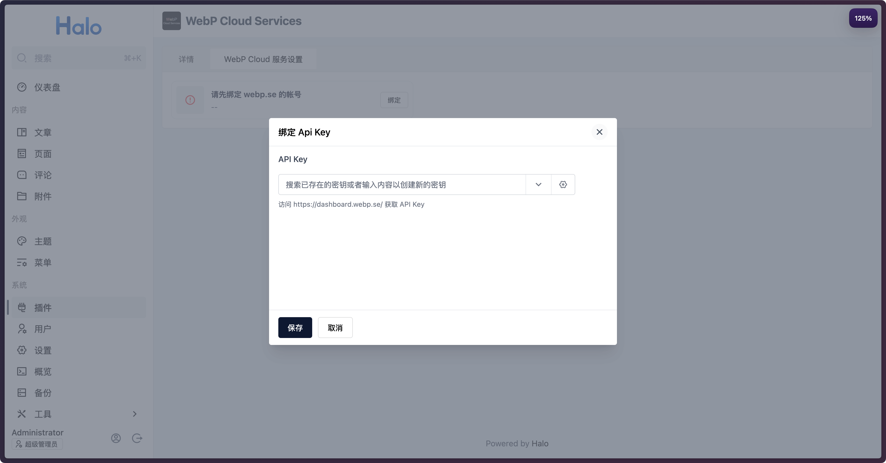
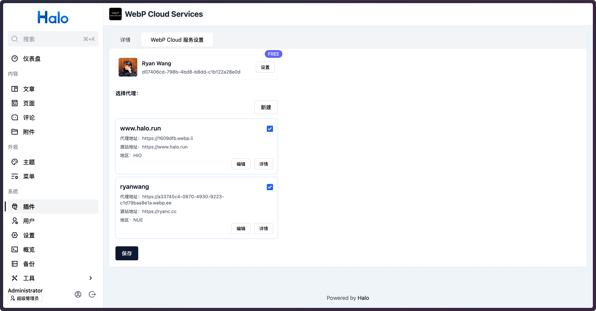
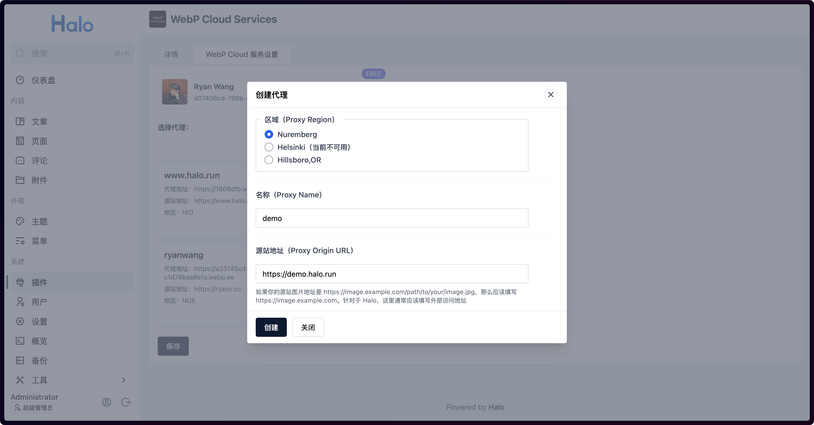

# WebP Cloud Halo plugin

此插件提供对 WebP Cloud（<https://webp.se>）的集成，支持在文章页面无入侵式的自动替换图片为 WebP/AVIF 格式。

## 特性

- 支持无入侵式的替换网站中所有的图片链接为 WebP/AVIF 格式的链接。
- 简单方便的配置界面，配置好 <https://webp.se> 的 API Key 之后即可选择或创建代理地址。

## 安装与使用

1. 在[应用市场](https://www.halo.run/store/apps/app-fVJSY)中安装并启用此插件。
2. 进入插件的设置页面，配置 API Key：

   

3. 选择已有的代理配置或者创建新的：

   

   

   > 请注意，如果你的网站图片是相对地址，那么你需要在源站地址中填写在 Halo 中配置好的外部访问地址，例如 `https://example.com`，这样插件才能正确的替换图片地址。

4. 最后保存即可。

## 验证

进入任意一篇包含图片的文章，检查一下浏览器 Network 面板的图片请求地址，或者查看网页源代码，可以看到图片的源地址已经修改为了你设置的 `Proxy Address` 了。

