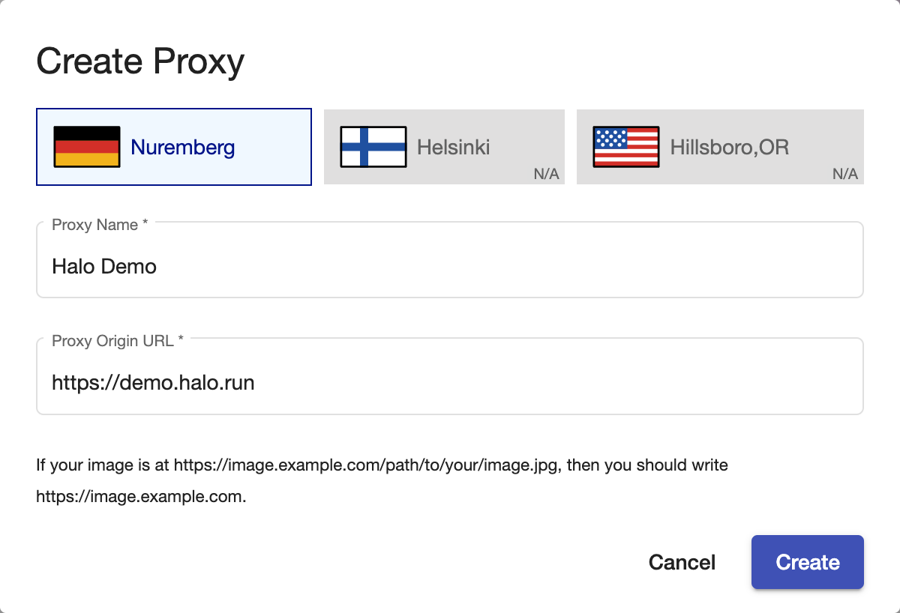
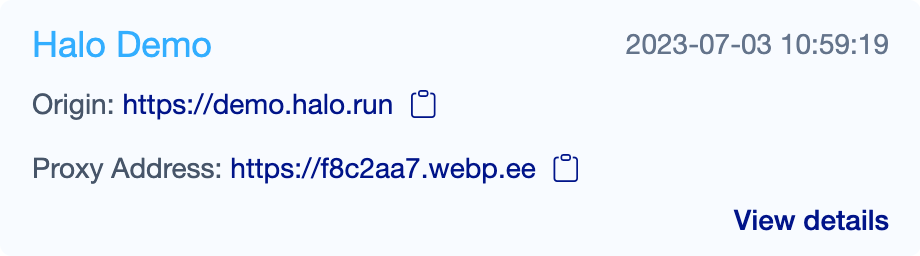
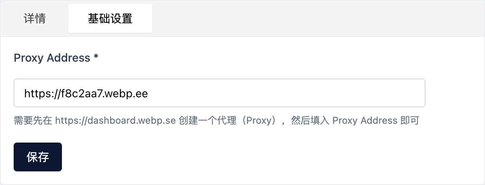
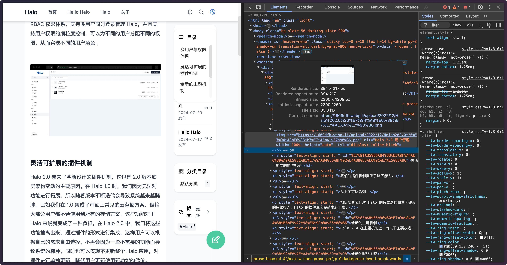

# WebP Cloud Halo plugin

此插件提供对 WebP Cloud（<https://webp.se>）的集成，支持在文章页面无入侵式的自动替换图片为 WebP/AVIF 格式。

## 使用

### 在 [WebP Cloud Dashboard](https://dashboard.webp.se/proxy) 创建一个代理（Proxy）

创建完成之后，就可以看到你的 `Proxy Address` 了：

## 下载并安装此插件

进入 [Releases](https://github.com/webp-sh/halo-plugin-webp-cloud/releases) 页面，选择最新版本下载 Assets 中的 `plugin-webp-cloud-xxx.jar` 文件即可。

安装插件的方式可以参考官方文档：<https://docs.halo.run/user-guide/plugins#%E5%AE%89%E8%A3%85%E6%8F%92%E4%BB%B6>

## 配置插件

安装完成之后，进入插件详情页面中的基础设置选项卡，填入你的 `Proxy Address`，保存即可。

最后，进入任意一篇包含图片的文章，检查一下浏览器的 Network 面板，就可以看到图片的源地址已经修改为了你设置的 `Proxy Address` 了。

